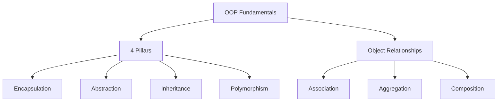

# 01 — OOP Fundamentals

> The vocabulary of Low Level Design. Every principle and pattern is built on
> these ideas. If these are shaky, patterns will feel like magic instead of
> logic.

---

## Why OOP for LLD?

LLD is about turning real-world requirements into **classes, objects, and their
relationships**. OOP gives us four pillars to model the world and two
relationships to connect objects. Master these and 80% of design "clicks".



---

## The 4 Pillars

### 1. Encapsulation — *bundle data + behavior, hide internals*

Keep the data (state) and the methods that operate on it together, and expose
only a safe public API. Callers should not reach into internal fields.

**Bad — anyone can corrupt the balance:**

```python
class Account:
    def __init__(self):
        self.balance = 0   # public, no validation

acc = Account()
acc.balance = -5000       # nothing stops this
```

**Good — internal state is protected behind methods:**

```python
class Account:
    def __init__(self):
        self.__balance = 0            # name-mangled "private"

    def deposit(self, amount: float) -> None:
        if amount <= 0:
            raise ValueError("Deposit must be positive")
        self.__balance += amount

    def withdraw(self, amount: float) -> None:
        if amount > self.__balance:
            raise ValueError("Insufficient funds")
        self.__balance -= amount

    def get_balance(self) -> float:
        return self.__balance
```

**Why it matters in LLD:** invariants (rules that must always hold) live in one
place. You can change *how* balance is stored without breaking callers.

> Python note: `_single` = "internal by convention", `__double` = name-mangled
> to discourage access. Python has no true `private`; encapsulation is a
> discipline, enforced with properties and conventions.

---

### 2. Abstraction — *expose WHAT, hide HOW*

Show a simple, stable interface; hide the complex implementation behind it.
Users of a `PaymentGateway` should not care whether it calls Stripe or PayPal.

```python
from abc import ABC, abstractmethod

class PaymentGateway(ABC):
    @abstractmethod
    def pay(self, amount: float) -> bool:
        ...

class StripeGateway(PaymentGateway):
    def pay(self, amount: float) -> bool:
        # complex Stripe API calls hidden here
        print(f"Paid {amount} via Stripe")
        return True

def checkout(gateway: PaymentGateway, amount: float):
    # checkout only knows the abstraction, not the details
    return gateway.pay(amount)
```

**Encapsulation vs Abstraction (common confusion):**

| Encapsulation | Abstraction |
|---------------|-------------|
| *Hides data* to protect it | *Hides complexity* to simplify |
| Implementation-level (access control) | Design-level (interfaces/contracts) |
| Achieved with private fields + methods | Achieved with abstract classes / interfaces |

---

### 3. Inheritance — *"is-a" reuse*

A subclass reuses and specializes a base class. Use it only for a true **is-a**
relationship.

```python
class Account(ABC):
    def __init__(self, balance: float = 0):
        self._balance = balance

    @abstractmethod
    def calculate_interest(self) -> float:
        ...

class SavingsAccount(Account):          # SavingsAccount IS-A Account
    def calculate_interest(self) -> float:
        return self._balance * 0.04

class CheckingAccount(Account):         # CheckingAccount IS-A Account
    def calculate_interest(self) -> float:
        return 0.0
```

**Trap:** don't inherit just to reuse code. If it's not a real "is-a", use
composition instead. A `Stack` is *not a* `List` even though it could reuse
list code — expose only `push`/`pop`, so composition is safer.

---

### 4. Polymorphism — *same call, different behavior*

One interface, many implementations chosen at runtime. This is what makes code
extensible without `if/else` chains.

```python
accounts: list[Account] = [SavingsAccount(1000), CheckingAccount(1000)]

for acc in accounts:
    # same method call, different behavior per object
    print(acc.calculate_interest())
```

Two flavors:
- **Runtime (dynamic):** method overriding — resolved by the object's actual
  type. This is the LLD-relevant one.
- **Compile-time (static):** method overloading — Python fakes this with default
  args / `*args`; less central to design.

**Why it matters:** polymorphism is the engine behind Strategy, State, Factory,
and most other patterns. "Program to an interface" only works because of it.

---

## Object Relationships (more important than inheritance!)

Real designs are built mostly by **connecting objects**, not by deep inheritance
trees. Three relationships, in increasing strength of ownership:

```mermaid
graph LR
    A[Association<br/>"uses-a"] --> B[Aggregation<br/>"has-a", weak]
    B --> C[Composition<br/>"has-a", strong]
```

### Association — "uses-a" (loosest)
Objects know about each other but have independent lifecycles.

```python
class Doctor:
    def treat(self, patient: "Patient") -> None: ...

class Patient:
    pass
# A Doctor uses Patients, but neither owns the other.
```

### Aggregation — "has-a", weak ownership
A whole references parts, but the parts **outlive** the whole.

```python
class Team:
    def __init__(self, players: list["Player"]):
        self.players = players   # players exist independently of the team

class Player:
    pass
# Disband the team → players still exist.
```

### Composition — "has-a", strong ownership
The part's lifecycle is **bound** to the whole. Destroy the whole → parts die.

```python
class Car:
    def __init__(self):
        self.engine = Engine()   # created and owned by the Car

class Engine:
    pass
# No Car → its Engine has no independent existence.
```

| Relationship | Meaning | Lifecycle | Example |
|--------------|---------|-----------|---------|
| Association | "uses-a" | Independent | Doctor ↔ Patient |
| Aggregation | "has-a" (weak) | Part outlives whole | Team ◇ Player |
| Composition | "has-a" (strong) | Part dies with whole | Car ◆ Engine |

---

## The single most important takeaway

> **Favor composition over inheritance.**

Inheritance is rigid — it locks behavior at class-definition time and creates
tight coupling to the parent. Composition lets you **swap behavior at runtime**
and keeps classes small and focused.

**Inheritance (rigid):**

```python
class FlyingRobot(Robot): ...      # what if a robot switches to walking?
```

**Composition (flexible):**

```python
class Robot:
    def __init__(self, movement: Movement):
        self.movement = movement    # swap FlyingMovement <-> WalkingMovement anytime

    def move(self):
        self.movement.move()
```

This idea is literally the Strategy pattern — you'll see it again and again.

---

## Quick self-check

1. What's the difference between encapsulation and abstraction?
2. Give a "has-a" relationship where the part should outlive the whole.
3. Why is `Square extends Rectangle` a classic inheritance trap?
4. Which pillar makes patterns like Strategy and State possible?
5. Rewrite a `FlyingBird`/`WalkingBird` inheritance tree using composition.

---

## Where this maps in the repo
- `concepts_and_problems/oop/` — runnable examples of each pillar & relationship.
- Next up: **02 — Design Principles (SOLID)**, which are *rules* for using these
  pillars well.
```