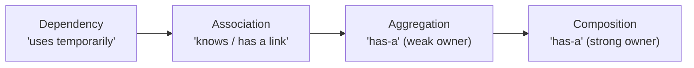
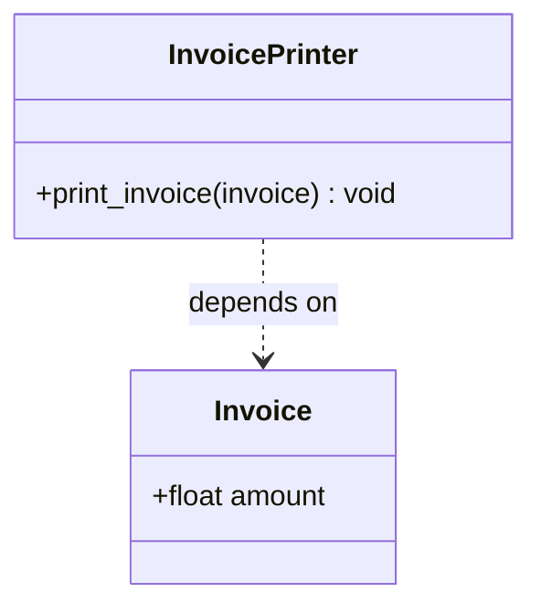
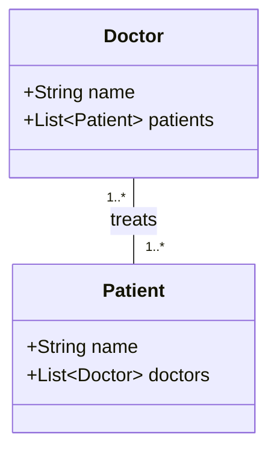
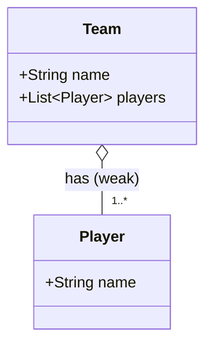
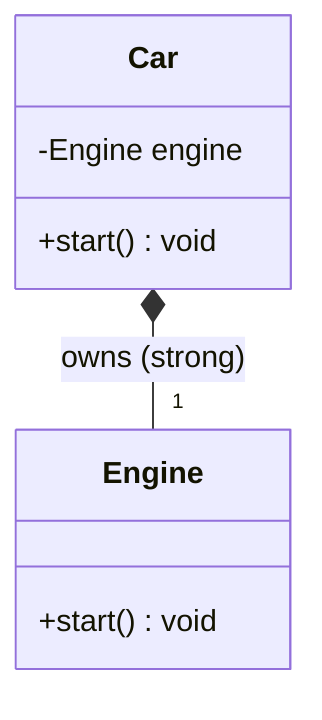
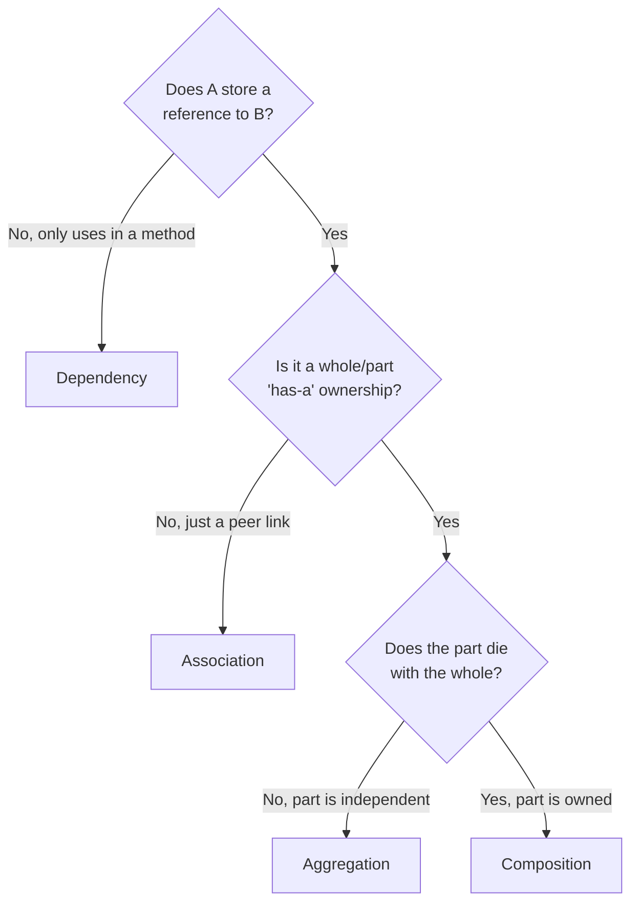

# 02 — Class Relationships

> How objects connect is *more* important than inheritance in real designs.
> There are four relationships you must recognize and draw correctly in UML:
> **Dependency, Association, Aggregation, Composition**.

---

## The big picture

All four describe "how does class A relate to class B?" They differ in **how
strong the link is** and **who owns whose lifecycle**.



Strength of coupling increases left → right:

| Relationship | Verb | Coupling | Lifecycle link | UML arrow |
|--------------|------|----------|----------------|-----------|
| Dependency | "uses-a" (briefly) | Weakest | None | dashed arrow `- - ▷` |
| Association | "knows-a" | Weak | Independent | solid line `───` |
| Aggregation | "has-a" (weak) | Medium | Part outlives whole | hollow diamond `◇──` |
| Composition | "has-a" (strong) | Strongest | Part dies with whole | filled diamond `◆──` |

---

## 1. Dependency — *"uses-a", temporary*

The weakest link. Class A uses class B **briefly**, usually as a **method
parameter, local variable, or return type** — not stored as a field. If B's API
changes, A might break; that's the "dependency".

```python
class Invoice:
    def __init__(self, amount: float):
        self.amount = amount

class InvoicePrinter:
    def print_invoice(self, invoice: Invoice) -> None:   # depends on Invoice
        # 'invoice' is a parameter, not stored as state
        print(f"Invoice total: {invoice.amount}")
```

- `InvoicePrinter` **depends on** `Invoice`, but does not *hold* one.
- Remove the `print_invoice` call → the relationship disappears entirely.

**UML:** dashed arrow pointing to the thing being used.



**Signals you have a Dependency:**
- Object appears only inside a method signature or body.
- "A needs B to do one job, then forgets about it."

---

## 2. Association — *"knows-a", a persistent link*

A structural link where objects reference each other and have **independent
lifecycles**. Stronger than dependency because the reference is usually stored,
but neither object owns the other.

```python
class Doctor:
    def __init__(self, name: str):
        self.name = name
        self.patients: list["Patient"] = []   # stored link

class Patient:
    def __init__(self, name: str):
        self.name = name
        self.doctors: list[Doctor] = []
```

- A `Doctor` treats many `Patient`s; a `Patient` sees many `Doctor`s.
- Delete the doctor → patients still exist, and vice versa.

**Directionality & multiplicity** (interview vocabulary):
- **Unidirectional**: only one side knows the other (`Order → Customer`).
- **Bidirectional**: both sides reference each other (`Doctor ↔ Patient`).
- **Multiplicity**: `1`, `0..1`, `1..*`, `*` — how many objects on each end.

**UML:** plain solid line (add arrowhead for direction).



> Aggregation and Composition are actually **special, stronger kinds of
> association** where ownership is involved.

---

## 3. Aggregation — *"has-a", weak ownership*

A whole/part relationship where **parts can exist independently** of the whole.
The whole holds references it did **not** create and does **not** exclusively
own. Often the parts are *passed in* (injected).

```python
class Player:
    def __init__(self, name: str):
        self.name = name

class Team:
    def __init__(self, name: str, players: list[Player]):
        self.name = name
        self.players = players     # players created OUTSIDE, shared/independent

# Players exist first, then join a team:
p1, p2 = Player("Alice"), Player("Bob")
team = Team("Rockets", [p1, p2])
# Disband the team → p1, p2 still exist and can join another team.
```

**Key tell:** the part is **created elsewhere** and injected in. The whole is a
container/organizer, not an owner.

**UML:** hollow (unfilled) diamond on the *whole* side.



---

## 4. Composition — *"has-a", strong ownership*

A whole/part relationship where the **part's lifecycle is bound to the whole**.
The whole **creates and owns** the part; destroy the whole and the part is gone.
The part usually cannot be shared.

```python
class Engine:
    def start(self) -> None:
        print("Engine started")

class Car:
    def __init__(self):
        self.engine = Engine()     # created and OWNED here, internally

    def start(self) -> None:
        self.engine.start()

# No independent Engine — it lives and dies with its Car.
```

Another classic: a `House` composes `Room`s; demolish the house → the rooms
cease to exist.

**Key tell:** the part is **created inside** the whole and not exposed/shared.

**UML:** filled (solid) diamond on the *whole* side.



---

## Aggregation vs Composition — the exact difference

This comparison gets asked a lot. Both are "has-a"; the difference is
**ownership and lifecycle**.

| | Aggregation | Composition |
|---|-------------|-------------|
| Ownership | Weak (shares) | Strong (owns) |
| Who creates the part? | Outside, injected in | Inside the whole |
| Part outlives whole? | Yes | No |
| Can the part be shared? | Yes | Usually no |
| Example | Team ◇ Player | Car ◆ Engine |
| UML diamond | Hollow `◇` | Filled `◆` |

Mental test: **"If I destroy the whole, should the part also be destroyed?"**
- Yes → Composition.
- No → Aggregation.

---

## Decision flow: which relationship is it?



---

## Why this matters for LLD interviews

- **Drawing class diagrams**: you must pick the right arrow. Using a filled
  diamond where it should be hollow signals you don't understand ownership.
- **Coupling control**: prefer weaker relationships (dependency/association) to
  keep classes loosely coupled and testable.
- **Dependency Injection**: aggregation is DI in action — pass collaborators in
  rather than hard-creating them (enables mocking, swapping, testing).

---

## Quick self-check

1. You see class B only as a method parameter in class A. Which relationship?
2. A `Playlist` holds `Song`s that also exist in other playlists. Aggregation or
   composition?
3. An `Order` creates its `OrderLine`s internally and they're meaningless without
   the order. Which one? Which UML diamond?
4. What's the one-line mental test to distinguish aggregation from composition?
5. Which relationship maps directly to Dependency Injection?

---

## Where this maps in the repo
- `concepts_and_problems/oop/association/`, `aggregation/`, `composition/`.
- Next up: **03 — Design Principles (DRY, YAGNI, KISS, SOLID)**.
```