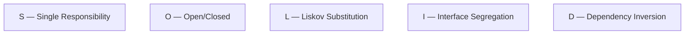
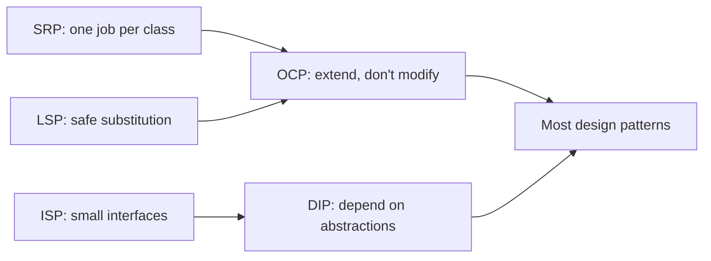

# 03 — Design Principles

> Principles are the *rules* for using OOP well. Patterns are concrete solutions;
> principles are the reasoning behind them. If you understand these, you can
> often design well **without** memorizing patterns.

Two groups:
1. **Pragmatic principles** — DRY, KISS, YAGNI (keep code simple & lean).
2. **SOLID** — five principles for flexible, maintainable OO design.

---

## Part A — Pragmatic Principles

### DRY — Don't Repeat Yourself

Every piece of knowledge should have **one** authoritative representation.
Duplication means bugs must be fixed in many places.

**Bad — tax logic duplicated:**

```python
def price_with_tax_india(p):   return p + p * 0.18
def price_with_tax_usa(p):     return p + p * 0.07
# add a country -> copy-paste again, easy to get out of sync
```

**Good — one source of truth:**

```python
TAX_RATES = {"IN": 0.18, "US": 0.07}

def price_with_tax(price: float, country: str) -> float:
    return price + price * TAX_RATES[country]
```

⚠️ **Don't over-DRY.** Forcing unrelated code that just *looks* similar into one
abstraction creates coupling. Duplication is cheaper than the *wrong*
abstraction. Extract only when the knowledge is genuinely the same.

---

### KISS — Keep It Simple, Stupid

Prefer the simplest solution that works. Complexity should be justified by real
requirements, not cleverness.

**Over-engineered:**

```python
# A configurable, plugin-based, strategy-driven even-number checker...
```

**Simple:**

```python
def is_even(n: int) -> bool:
    return n % 2 == 0
```

Signs you're violating KISS: deep inheritance, needless abstraction layers,
"flexible" frameworks for a one-off task, cleverness that needs a comment to
explain.

---

### YAGNI — You Aren't Gonna Need It

Don't build features or generality for a future that may never come. Build for
today's requirements.

- ❌ Adding a `PaymentGateway` abstraction with 6 providers when the product only
  accepts one — "just in case".
- ✅ Implement the one you need; refactor to an abstraction *when the second
  provider actually arrives*.

**KISS vs YAGNI:** KISS = "make what you build simple." YAGNI = "don't build it
at all until needed." They work together against over-engineering.

---

## Part B — SOLID

Five principles (Robert C. Martin) for OO design that resists rot.



---

### S — Single Responsibility Principle (SRP)

> A class should have **one reason to change** (one responsibility / one actor).

**Violation — three responsibilities in one class:**

```python
class Report:
    def generate(self): ...        # business logic
    def format_as_pdf(self): ...   # presentation
    def save_to_db(self): ...      # persistence
```

A change in PDF formatting, DB schema, *or* business rules all force edits here.

**Fix — split by responsibility:**

```python
class Report:            # business data/logic only
    ...

class ReportFormatter:   # presentation
    def to_pdf(self, report: Report) -> bytes: ...

class ReportRepository:  # persistence
    def save(self, report: Report) -> None: ...
```

Benefit: each class is small, testable, and changes in isolation.

---

### O — Open/Closed Principle (OCP)

> Software entities should be **open for extension, closed for modification**.
> Add new behavior by adding new code, not editing existing code.

**Violation — must edit the method for every new shape:**

```python
class AreaCalculator:
    def area(self, shape):
        if shape.type == "circle":
            return 3.14 * shape.r ** 2
        elif shape.type == "square":
            return shape.side ** 2
        # add triangle -> edit this method again (risk breaking it)
```

**Fix — polymorphism; extend by adding a class:**

```python
from abc import ABC, abstractmethod

class Shape(ABC):
    @abstractmethod
    def area(self) -> float: ...

class Circle(Shape):
    def __init__(self, r): self.r = r
    def area(self): return 3.14 * self.r ** 2

class Square(Shape):
    def __init__(self, s): self.s = s
    def area(self): return self.s ** 2

# New shape? Add a class. AreaCalculator never changes:
def total_area(shapes: list[Shape]) -> float:
    return sum(s.area() for s in shapes)
```

> OCP is *why* patterns like **Strategy**, **Factory**, and **Decorator** exist.

---

### L — Liskov Substitution Principle (LSP)

> Subtypes must be substitutable for their base type **without breaking
> correctness**. A subclass shouldn't violate the expectations set by the parent.

**Classic violation — Square breaks Rectangle's contract:**

```python
class Rectangle:
    def __init__(self, w, h): self._w, self._h = w, h
    def set_width(self, w):  self._w = w
    def set_height(self, h): self._h = h
    def area(self): return self._w * self._h

class Square(Rectangle):
    def set_width(self, w):  self._w = self._h = w   # side effect!
    def set_height(self, h): self._w = self._h = h

def resize(rect: Rectangle):
    rect.set_width(5)
    rect.set_height(4)
    assert rect.area() == 20    # FAILS for Square (gives 16)
```

`Square` *is-a* `Rectangle` mathematically, but not behaviorally. Fix: don't
force the inheritance — model them separately (e.g., a common `Shape` interface).

**LSP rules of thumb — a subclass must not:**
- Strengthen preconditions (demand more than the parent).
- Weaken postconditions (deliver less than the parent promised).
- Throw new unexpected exceptions or return incompatible types.

---

### I — Interface Segregation Principle (ISP)

> Don't force a class to depend on methods it doesn't use. Prefer many small,
> role-specific interfaces over one fat interface.

**Violation — a fat interface:**

```python
class Machine(ABC):
    @abstractmethod
    def print(self): ...
    @abstractmethod
    def scan(self): ...
    @abstractmethod
    def fax(self): ...

class OldPrinter(Machine):
    def print(self): ...
    def scan(self): raise NotImplementedError   # forced to implement junk
    def fax(self):  raise NotImplementedError
```

**Fix — split into focused interfaces:**

```python
class Printer(ABC):
    @abstractmethod
    def print(self): ...

class Scanner(ABC):
    @abstractmethod
    def scan(self): ...

class OldPrinter(Printer):          # only what it truly supports
    def print(self): ...

class AllInOne(Printer, Scanner):   # compose the roles it needs
    def print(self): ...
    def scan(self): ...
```

---

### D — Dependency Inversion Principle (DIP)

> High-level modules should not depend on low-level modules. **Both should depend
> on abstractions.** Depend on interfaces, not concrete classes.

**Violation — high-level service nailed to a concrete DB:**

```python
class MySQLDatabase:
    def save(self, data): ...

class OrderService:
    def __init__(self):
        self.db = MySQLDatabase()   # hard-wired; can't swap or mock
```

**Fix — depend on an abstraction, inject the concrete:**

```python
class Database(ABC):
    @abstractmethod
    def save(self, data): ...

class MySQLDatabase(Database):
    def save(self, data): ...

class OrderService:
    def __init__(self, db: Database):   # abstraction, injected
        self.db = db

# Swap freely: OrderService(MySQLDatabase()) or OrderService(FakeDB()) in tests
```

> DIP + injection is what makes code **testable** (mock the abstraction) and
> **flexible** (swap implementations). It's the backbone of clean architecture.

---

## How the principles connect



- SRP keeps classes small → easier to keep OCP.
- OCP relies on polymorphism → needs LSP to be safe.
- DIP + ISP make polymorphism practical and testable.
- Together they *lead you toward* the design patterns naturally.

---

## Quick self-check

1. What single question tells you a class violates SRP?
2. Which principle does a big `if/elif` on a "type" field usually violate, and
   which pattern fixes it?
3. Why is `Square extends Rectangle` an LSP (not just an inheritance) problem?
4. Rewrite a fat `Machine` interface to satisfy ISP.
5. How does DIP make unit testing easier?
6. When can DRY actually make code *worse*?

---

## Where this maps in the repo
- Applied throughout `concepts_and_problems/design-patterns/` (esp. Strategy for
  OCP, Factory for DIP).
- Next up: **04 — Creational Patterns**.
```