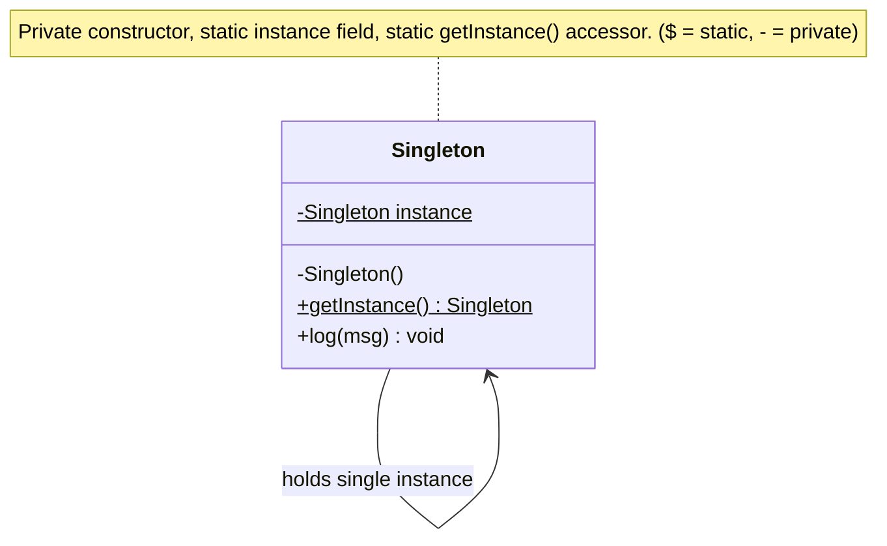
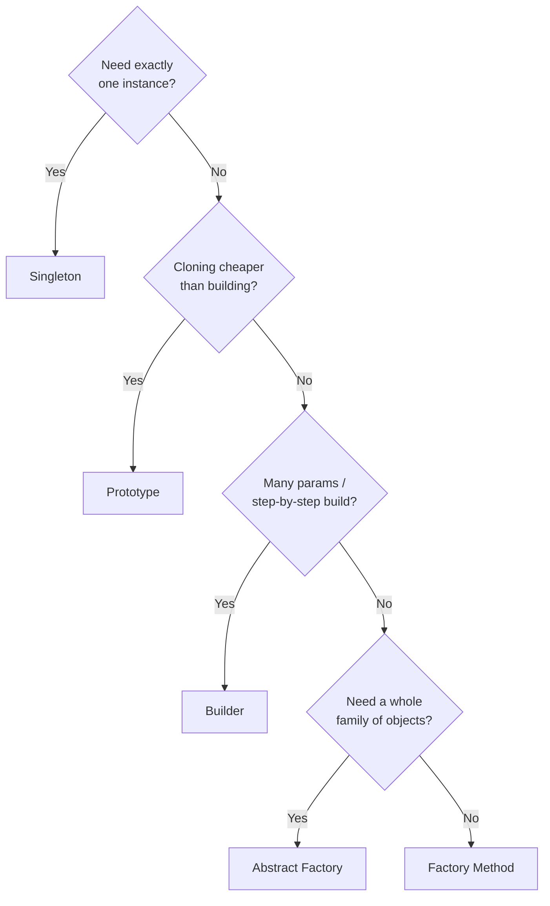

# 04 — Creational Patterns

> Creational patterns deal with **how objects are created**. They decouple your
> code from the concrete classes it instantiates, so creation logic can vary
> without breaking the code that uses the objects.

The five GoF creational patterns:

| Pattern | One-line intent |
|---------|-----------------|
| Singleton | Ensure a class has exactly **one** instance, globally accessible |
| Factory Method | Let a method decide **which class** to instantiate |
| Abstract Factory | Create **families** of related objects |
| Builder | Construct a **complex object step by step** |
| Prototype | Create new objects by **cloning** an existing one |

---

## 1. Singleton

**Intent:** exactly one instance of a class, with a global access point.

**Use when:** shared resource that must be unique — configuration, logger,
connection pool, cache, thread pool.

```python
import threading

class Logger:
    _instance = None
    _lock = threading.Lock()

    def __new__(cls):
        if cls._instance is None:
            with cls._lock:                 # thread-safe double-checked locking
                if cls._instance is None:
                    cls._instance = super().__new__(cls)
        return cls._instance

    def log(self, msg: str) -> None:
        print(f"[LOG] {msg}")

a = Logger()
b = Logger()
assert a is b        # same object
```

**Pythonic alternative:** a module is already a singleton — a module-level object
or a `@lru_cache`-decorated factory often beats a hand-rolled Singleton.

```python
from functools import lru_cache

@lru_cache(maxsize=1)
def get_config() -> "Config":
    return Config()
```

**Trade-offs (know these — interviewers probe them):**
- ➖ Acts as global state → hidden dependencies, hard to unit test (can't easily
  swap/muck a global).
- ➖ Can hide violations of SRP (the class does its job *and* manages its lifecycle).
- ➖ Thread-safety must be handled explicitly.
- ✅ Guarantees uniqueness and lazy initialization.

**UML:**



---

## 2. Factory Method

**Intent:** define an interface for creating an object, but let subclasses (or a
method) decide which concrete class to instantiate. Removes `new ConcreteClass`
from client code.

**Use when:** the exact type isn't known until runtime, or you want to centralize
and name the creation logic.

```python
from abc import ABC, abstractmethod

class Notification(ABC):
    @abstractmethod
    def send(self, msg: str) -> None: ...

class EmailNotification(Notification):
    def send(self, msg): print(f"Email: {msg}")

class SMSNotification(Notification):
    def send(self, msg): print(f"SMS: {msg}")

class NotificationFactory:
    @staticmethod
    def create(channel: str) -> Notification:
        match channel:
            case "email": return EmailNotification()
            case "sms":   return SMSNotification()
            case _:       raise ValueError(f"Unknown channel: {channel}")

# Client depends only on the abstraction + factory:
notif = NotificationFactory.create("email")
notif.send("Hello")
```

**Why it's good:** satisfies **OCP** (add a new type by adding a class + one
factory branch) and **DIP** (clients depend on `Notification`, not concretes).

**Factory Method vs Simple Factory:** the snippet above is technically a "simple
factory" (a static method). True GoF Factory Method puts the creating method on a
base class and overrides it in subclasses. In interviews the *intent* matters
more than the label.

---

## 3. Abstract Factory

**Intent:** create **families of related objects** without specifying their
concrete classes. A "factory of factories."

**Use when:** you have multiple product families that must be used together and
kept consistent (e.g., a UI toolkit where all widgets must match one OS theme).

```python
from abc import ABC, abstractmethod

# --- Abstract products ---
class Button(ABC):
    @abstractmethod
    def render(self): ...

class Checkbox(ABC):
    @abstractmethod
    def render(self): ...

# --- Concrete products: Windows family ---
class WinButton(Button):
    def render(self): print("Windows button")
class WinCheckbox(Checkbox):
    def render(self): print("Windows checkbox")

# --- Concrete products: Mac family ---
class MacButton(Button):
    def render(self): print("Mac button")
class MacCheckbox(Checkbox):
    def render(self): print("Mac checkbox")

# --- Abstract factory ---
class GUIFactory(ABC):
    @abstractmethod
    def create_button(self) -> Button: ...
    @abstractmethod
    def create_checkbox(self) -> Checkbox: ...

class WindowsFactory(GUIFactory):
    def create_button(self):   return WinButton()
    def create_checkbox(self): return WinCheckbox()

class MacFactory(GUIFactory):
    def create_button(self):   return MacButton()
    def create_checkbox(self): return MacCheckbox()

def build_ui(factory: GUIFactory):
    factory.create_button().render()
    factory.create_checkbox().render()

build_ui(MacFactory())   # guarantees a consistent Mac-themed family
```

**Factory Method vs Abstract Factory:**
- Factory Method creates **one product**.
- Abstract Factory creates **a family of related products** (and typically uses
  several factory methods internally).

---

## 4. Builder

**Intent:** construct a complex object **step by step**, separating construction
from representation. Avoids "telescoping constructors" with many parameters.

**Use when:** an object has many optional fields, or construction requires a
specific sequence / validation.

```python
class HttpRequest:
    def __init__(self, method, url, headers, body, timeout):
        self.method, self.url = method, url
        self.headers, self.body, self.timeout = headers, body, timeout

class HttpRequestBuilder:
    def __init__(self, url: str):
        self._url = url
        self._method = "GET"
        self._headers: dict = {}
        self._body = None
        self._timeout = 30

    def method(self, m: str):        self._method = m;  return self   # fluent
    def header(self, k: str, v: str): self._headers[k] = v; return self
    def body(self, b: str):          self._body = b;   return self
    def timeout(self, t: int):       self._timeout = t; return self

    def build(self) -> HttpRequest:
        # central place to validate before creating
        return HttpRequest(self._method, self._url,
                           self._headers, self._body, self._timeout)

req = (HttpRequestBuilder("https://api.example.com")
       .method("POST")
       .header("Content-Type", "application/json")
       .body('{"x":1}')
       .timeout(60)
       .build())
```

Each setter returns `self` → **fluent/chained** API. `build()` returns the final,
validated, often immutable object.

**Trade-offs:**
- ✅ Readable construction of objects with many optional params.
- ✅ Can enforce invariants in `build()`.
- ➖ More boilerplate than a plain constructor. In Python, a `@dataclass` with
  keyword args or `**kwargs` often covers simpler cases — reach for Builder when
  there's real step-wise logic/validation.

---

## 5. Prototype

**Intent:** create new objects by **cloning an existing instance** (the
prototype) rather than constructing from scratch.

**Use when:** object creation is expensive (heavy setup, DB/network), or you want
copies of a pre-configured template.

```python
import copy

class Document:
    def __init__(self, title: str, styles: dict, sections: list):
        self.title = title
        self.styles = styles          # expensive to build
        self.sections = sections

    def clone(self) -> "Document":
        return copy.deepcopy(self)    # independent deep copy

template = Document("Template", {"font": "Arial", "size": 12}, ["intro"])

doc1 = template.clone()
doc1.title = "Report A"
doc2 = template.clone()
doc2.title = "Report B"
# doc1 and doc2 share the template's config but are independent objects
```

**Shallow vs deep copy (critical detail):**
- `copy.copy` → shallow: nested objects are **shared** (mutating one affects
  clones).
- `copy.deepcopy` → deep: nested objects are **duplicated** (fully independent).

Choose based on whether clones should share sub-objects.

---

## Choosing a creational pattern



| Pattern | Creates | Key benefit |
|---------|---------|-------------|
| Singleton | 1 shared instance | Uniqueness / global access |
| Factory Method | 1 object, type chosen at runtime | Decouples client from concretes (OCP/DIP) |
| Abstract Factory | A family of related objects | Consistency across a family |
| Builder | 1 complex object, step by step | Readable, validated construction |
| Prototype | 1 object by cloning | Avoids costly re-construction |

---

## Quick self-check

1. Name two downsides of Singleton an interviewer will expect you to mention.
2. Difference between Factory Method and Abstract Factory in one sentence?
3. Which pattern removes "telescoping constructors"?
4. Shallow vs deep clone — when does the difference bite you?
5. What's the most Pythonic way to get singleton behavior without `__new__`?

---

## Where this maps in the repo
- `concepts_and_problems/design-patterns/singleton/`, `factory/`,
  `abstractfactory/`, `builder/`, `prototype/`.
- Next up: **05 — Structural Patterns**.
```