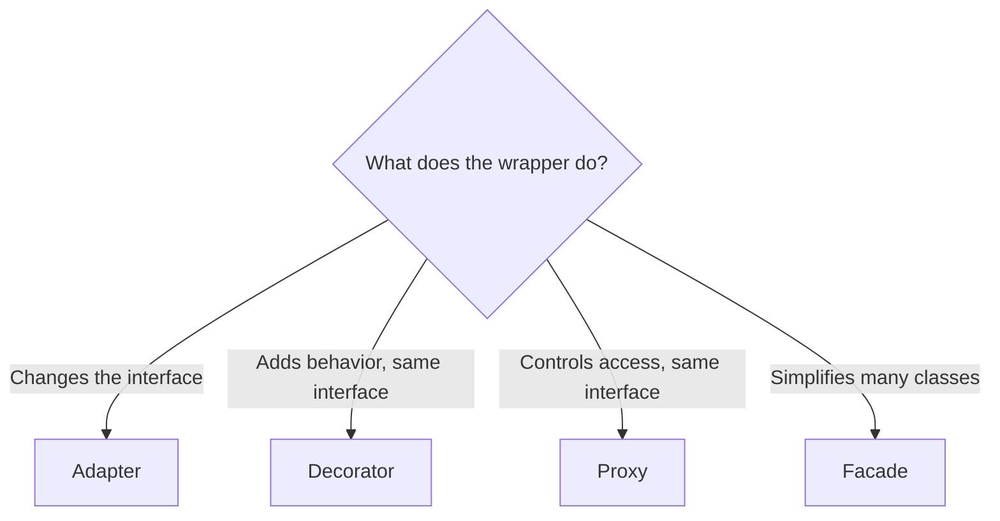

# 05 — Structural Patterns

> Structural patterns deal with **how classes and objects are composed** into
> larger structures while keeping them flexible and efficient. They're about
> *relationships and wiring*, not creation or behavior.

The seven GoF structural patterns:

| Pattern | One-line intent |
|---------|-----------------|
| Adapter | Make an **incompatible interface** usable via a wrapper |
| Bridge | **Decouple abstraction from implementation** so both vary independently |
| Composite | Treat **individual objects and groups uniformly** (tree structures) |
| Decorator | **Add behavior dynamically** without subclassing |
| Facade | Provide a **simple interface** over a complex subsystem |
| Flyweight | **Share objects** to save memory |
| Proxy | Provide a **placeholder/surrogate** controlling access to an object |

---

## 1. Adapter

**Intent:** convert the interface of a class into another interface clients
expect. Lets incompatible interfaces work together.

**Use when:** integrating a third-party/legacy class whose API doesn't match
what your code needs.

```python
# Existing code expects this interface:
class PaymentProcessor:
    def pay(self, amount: float) -> None: ...

# Third-party class with a DIFFERENT interface (can't change it):
class StripeAPI:
    def make_payment(self, cents: int) -> None:
        print(f"Stripe charged {cents} cents")

# Adapter conforms Stripe to our interface:
class StripeAdapter(PaymentProcessor):
    def __init__(self, stripe: StripeAPI):
        self._stripe = stripe

    def pay(self, amount: float) -> None:
        self._stripe.make_payment(int(amount * 100))   # translate the call

processor: PaymentProcessor = StripeAdapter(StripeAPI())
processor.pay(20.0)      # client uses its own interface, unaware of Stripe
```

**Adapter vs Decorator vs Proxy (all wrap):** Adapter **changes** the interface;
Decorator **adds behavior** with the same interface; Proxy **controls access**
with the same interface.

---

## 2. Bridge

**Intent:** split a large class (or a set of closely related classes) into two
independent hierarchies — **abstraction** and **implementation** — that can vary
separately. Prevents a combinatorial explosion of subclasses.

**Use when:** you'd otherwise get classes like `RedCircle`, `BlueCircle`,
`RedSquare`, `BlueSquare`… (shape × color). Bridge turns `M × N` subclasses into
`M + N`.

```python
from abc import ABC, abstractmethod

# --- Implementation hierarchy ---
class Renderer(ABC):
    @abstractmethod
    def render_circle(self, radius: float): ...

class VectorRenderer(Renderer):
    def render_circle(self, radius): print(f"Vector circle r={radius}")

class RasterRenderer(Renderer):
    def render_circle(self, radius): print(f"Raster circle r={radius}")

# --- Abstraction hierarchy (holds a bridge to an implementation) ---
class Shape(ABC):
    def __init__(self, renderer: Renderer):
        self.renderer = renderer            # THE BRIDGE
    @abstractmethod
    def draw(self): ...

class Circle(Shape):
    def __init__(self, renderer, radius):
        super().__init__(renderer)
        self.radius = radius
    def draw(self):
        self.renderer.render_circle(self.radius)

Circle(VectorRenderer(), 5).draw()   # mix any shape with any renderer
Circle(RasterRenderer(), 5).draw()
```

**Bridge vs Strategy (look similar):** Bridge is *structural* — a permanent
abstraction/implementation split decided at design time. Strategy is
*behavioral* — swapping an algorithm at runtime.

---

## 3. Composite

**Intent:** compose objects into **tree structures** and let clients treat
individual objects (leaves) and compositions (branches) **uniformly** through a
common interface.

**Use when:** you have a part-whole hierarchy — file systems, UI component trees,
org charts, menus.

```python
from abc import ABC, abstractmethod

class FileSystemNode(ABC):
    def __init__(self, name: str):
        self.name = name
    @abstractmethod
    def size(self) -> int: ...

class File(FileSystemNode):              # leaf
    def __init__(self, name, size):
        super().__init__(name)
        self._size = size
    def size(self): return self._size

class Directory(FileSystemNode):         # composite
    def __init__(self, name):
        super().__init__(name)
        self.children: list[FileSystemNode] = []
    def add(self, node: FileSystemNode):
        self.children.append(node)
    def size(self):
        return sum(child.size() for child in self.children)   # recurse uniformly

root = Directory("root")
root.add(File("a.txt", 100))
sub = Directory("sub"); sub.add(File("b.txt", 200))
root.add(sub)
print(root.size())    # 300 — client calls size() without caring leaf vs branch
```

Key: `File` and `Directory` share the `size()` interface, so client code never
branches on type.

---

## 4. Decorator

**Intent:** attach additional responsibilities to an object **dynamically** by
wrapping it. A flexible alternative to subclassing for extending behavior.

**Use when:** you need many optional, combinable features (e.g., coffee + milk +
sugar; a data stream + compression + encryption).

```python
from abc import ABC, abstractmethod

class Coffee(ABC):
    @abstractmethod
    def cost(self) -> float: ...
    @abstractmethod
    def description(self) -> str: ...

class SimpleCoffee(Coffee):
    def cost(self): return 2.0
    def description(self): return "Coffee"

# Base decorator wraps a Coffee and IS a Coffee:
class CoffeeDecorator(Coffee):
    def __init__(self, coffee: Coffee):
        self._coffee = coffee

class Milk(CoffeeDecorator):
    def cost(self): return self._coffee.cost() + 0.5
    def description(self): return self._coffee.description() + " + Milk"

class Sugar(CoffeeDecorator):
    def cost(self): return self._coffee.cost() + 0.2
    def description(self): return self._coffee.description() + " + Sugar"

drink = Sugar(Milk(SimpleCoffee()))    # stack decorators in any order
print(drink.description(), drink.cost())   # "Coffee + Milk + Sugar" 2.7
```

**Decorator vs Inheritance:** inheritance fixes behavior at compile time and
explodes into subclasses for every combination; decorators combine at **runtime**
in any order. This is the OCP win.

> Python's `@decorator` syntax is a *related but different* concept (function
> wrapping). The design pattern is about wrapping *objects*.

---

## 5. Facade

**Intent:** provide a single, simplified interface to a complex subsystem. Hides
the messy internal wiring behind one friendly entry point.

**Use when:** a client needs to use a complicated set of classes but only cares
about a high-level operation.

```python
# Complex subsystem:
class Inventory:
    def reserve(self, item): print(f"Reserved {item}")
class Payment:
    def charge(self, amount): print(f"Charged {amount}")
class Shipping:
    def dispatch(self, item): print(f"Shipped {item}")

# Facade exposes ONE simple method:
class OrderFacade:
    def __init__(self):
        self._inventory = Inventory()
        self._payment = Payment()
        self._shipping = Shipping()

    def place_order(self, item: str, amount: float) -> None:
        self._inventory.reserve(item)
        self._payment.charge(amount)
        self._shipping.dispatch(item)

OrderFacade().place_order("Book", 20.0)   # client ignores all the internals
```

**Facade vs Adapter:** Facade *simplifies* many classes into one interface (new,
convenience-oriented). Adapter *converts* one existing interface into another
(compatibility-oriented).

---

## 6. Flyweight

**Intent:** minimize memory by **sharing** as much data as possible between many
similar objects. Split state into **intrinsic** (shared, stored in the flyweight)
and **extrinsic** (context-specific, passed in per use).

**Use when:** you must create a huge number of objects with lots of repeated
data — characters in a document, tiles/particles in a game, tree species in a
forest.

```python
class TreeType:                     # FLYWEIGHT: intrinsic, shared state
    def __init__(self, name, texture):
        self.name = name
        self.texture = texture      # heavy, shared across many trees
    def draw(self, x, y):           # extrinsic (x, y) passed in
        print(f"{self.name} at ({x},{y})")

class TreeFactory:
    _types: dict[str, TreeType] = {}
    @classmethod
    def get_type(cls, name, texture) -> TreeType:
        key = f"{name}:{texture}"
        if key not in cls._types:
            cls._types[key] = TreeType(name, texture)   # create once, reuse
        return cls._types[key]

# 1,000,000 trees share a handful of TreeType objects:
forest = [(TreeFactory.get_type("Oak", "oak.png"), x, x) for x in range(3)]
for ttype, x, y in forest:
    ttype.draw(x, y)
```

**Key idea:** the flyweight object holds only what's common; the varying
per-instance data lives outside and is supplied at call time.

---

## 7. Proxy

**Intent:** provide a surrogate/placeholder for another object to **control
access** to it — same interface as the real object.

**Common flavors:**
- **Virtual proxy** — lazy-load an expensive object on first use.
- **Protection proxy** — enforce access control/permissions.
- **Remote proxy** — represent an object in another address space (RPC).
- **Caching proxy** — cache results of expensive calls.

```python
from abc import ABC, abstractmethod

class Image(ABC):
    @abstractmethod
    def display(self): ...

class RealImage(Image):
    def __init__(self, filename: str):
        self._filename = filename
        self._load()                    # EXPENSIVE (disk/network)
    def _load(self): print(f"Loading {self._filename}")
    def display(self): print(f"Displaying {self._filename}")

class ImageProxy(Image):                # virtual proxy: defers loading
    def __init__(self, filename: str):
        self._filename = filename
        self._real: RealImage | None = None
    def display(self):
        if self._real is None:
            self._real = RealImage(self._filename)   # load on first use only
        self._real.display()

img = ImageProxy("photo.png")   # cheap — nothing loaded yet
img.display()                   # NOW it loads, then displays
img.display()                   # already loaded — just displays
```

**Proxy vs Decorator:** both wrap and share the interface, but Proxy **controls
access** (may not even call the real object), while Decorator **adds behavior**
and always delegates.

---

## Structural patterns at a glance

| Pattern | Wraps? | Purpose |
|---------|--------|---------|
| Adapter | Yes | Convert interface A → B |
| Bridge | No (composes) | Split abstraction from implementation |
| Composite | No (tree) | Uniform treatment of part-whole |
| Decorator | Yes | Add behavior dynamically |
| Facade | Yes (many) | Simplify a subsystem |
| Flyweight | No (shares) | Save memory via sharing |
| Proxy | Yes | Control access to an object |

**The "wrappers" — how to tell them apart:**



---

## Quick self-check

1. Adapter vs Facade — which converts, which simplifies?
2. How does Bridge turn `M × N` subclasses into `M + N`?
3. In Flyweight, what's the difference between intrinsic and extrinsic state?
4. Name three kinds of Proxy and what each controls.
5. Why do decorators beat subclassing for combinable features?
6. What common interface makes Composite work uniformly across leaf and branch?

---

## Where this maps in the repo
- `concepts_and_problems/design-patterns/adapter/`, `bridge/`, `composite/`,
  `decorator/`, `facade/`, `flyweight/`, `proxy/`.
- Next up: **06 — Behavioral Patterns**.
```