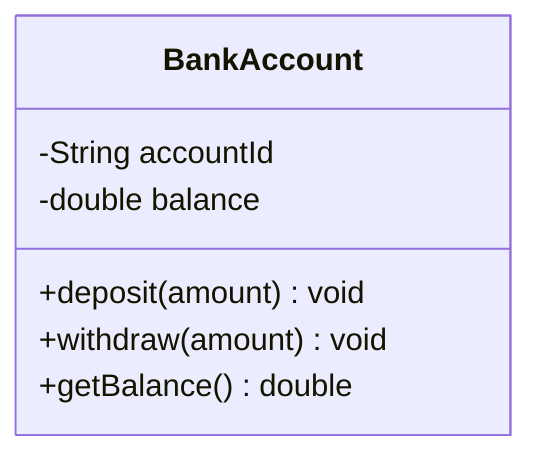
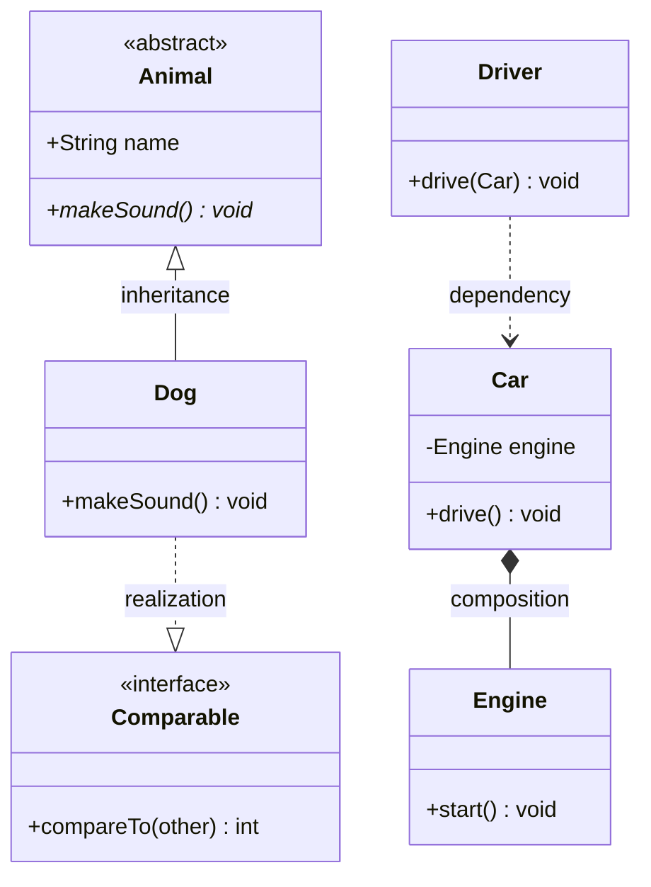
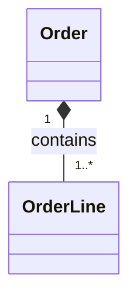
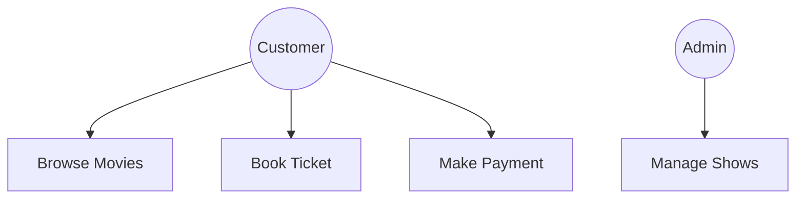
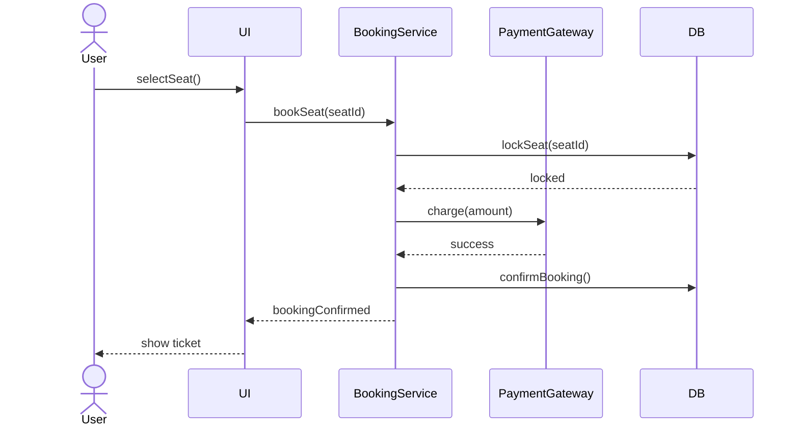
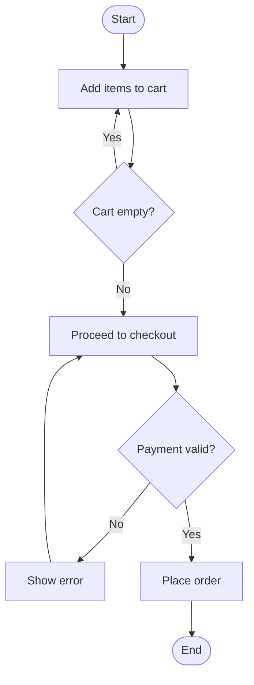
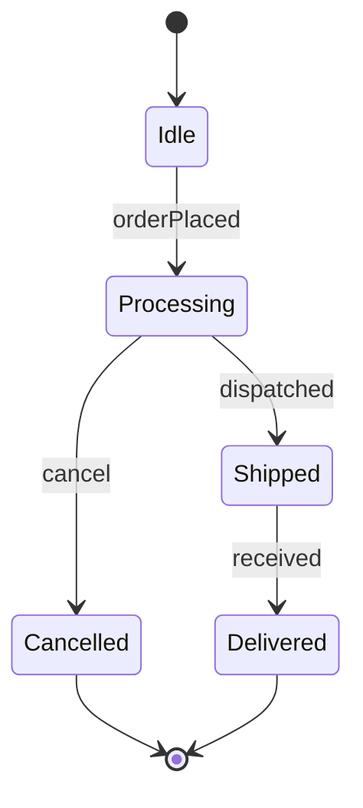
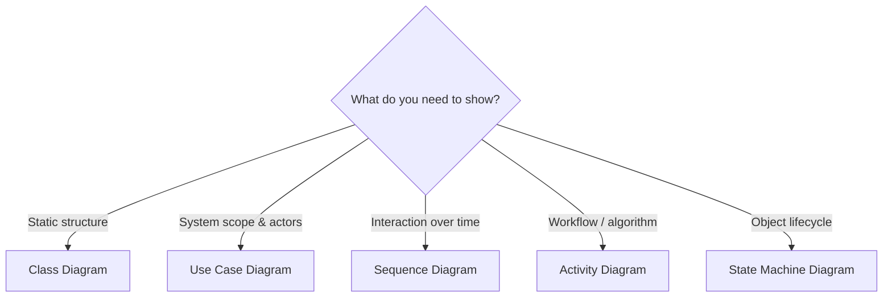

# 07 — UML Diagrams

> UML is the shared visual language for communicating a design in interviews and
> teams. For LLD you mainly need **Class diagrams** (structure) and **Sequence
> diagrams** (behavior); the others show up occasionally. This file uses Mermaid
> so the diagrams render directly in VS Code / GitHub.

Two broad categories:
- **Structural** — what the system *is*: **Class diagram**.
- **Behavioral** — what the system *does*: **Use Case, Sequence, Activity, State
  Machine** diagrams.

---

## 1. Class Diagram ⭐ (the one you must nail)

Shows classes, their attributes, methods, and the **relationships** between them.
This is the primary deliverable of an LLD interview.

### Class notation
Three compartments: **name / attributes / methods**. Visibility markers:
`+` public, `-` private, `#` protected, `~` package.



### Relationship arrows (memorize these)

| Relationship | Meaning | Mermaid syntax | Arrow |
|--------------|---------|----------------|-------|
| Inheritance ("is-a") | subclass → superclass | `<|--` | hollow triangle |
| Realization (implements) | class → interface | `..|>` | dashed hollow triangle |
| Composition (strong has-a) | part dies with whole | `*--` | filled diamond |
| Aggregation (weak has-a) | part outlives whole | `o--` | hollow diamond |
| Association (knows-a) | persistent link | `-->` | solid arrow |
| Dependency (uses-a) | temporary use | `..>` | dashed arrow |

### A worked example



Reading it: `Dog` **is an** `Animal`; `Car` **owns** an `Engine` (composition);
`Driver` **uses** a `Car` temporarily (dependency); `Dog` **implements**
`Comparable`.

### Multiplicity
Numbers on association ends show how many objects participate:
`1`, `0..1`, `1..*` (one or more), `*` (many).



> An `Order` contains one-or-more `OrderLine`s, and each line belongs to exactly
> one order (composition — lines don't exist without the order).

**Interview tip:** the most common mistake is using the wrong diamond
(composition vs aggregation) or a solid arrow where a triangle belongs. Get the
relationship semantics right (see file 02).

---

## 2. Use Case Diagram

Shows **actors** (users/external systems) and the **use cases** (goals) they
perform. High-level "what the system does for whom" — used early in requirements.



- **Actors**: stick figures / circles (Customer, Admin).
- **Use cases**: ovals (Book Ticket).
- Relationships: `<<include>>` (always-used sub-step), `<<extend>>` (optional
  behavior), and actor generalization.

Use it to scope the system and identify the classes you'll need. Not usually
drawn in detail in coding interviews, but great for framing requirements.

---

## 3. Sequence Diagram ⭐ (behavior over time)

Shows **how objects collaborate** by exchanging messages, ordered top-to-bottom
in time. Excellent for explaining a specific flow (e.g., "what happens when a
user books a ticket").



Elements:
- **Lifelines** — vertical lines per participant.
- **Activation bars** — periods an object is active.
- **Solid arrow** `->>` synchronous call; **dashed arrow** `-->>` return.
- Fragments: `alt` (if/else), `loop`, `opt` (optional), `par` (parallel).

**Interview use:** after drawing the class diagram, a sequence diagram proves your
classes actually collaborate to satisfy a use case.

---

## 4. Activity Diagram

A flowchart of the **workflow / business logic** — actions, decisions, parallel
paths. Good for showing an algorithm or process end-to-end.



Elements: start/end nodes, actions (rounded rectangles), **decisions**
(diamonds), and **fork/join** bars for concurrent flows. Think "flowchart with
UML rigor."

---

## 5. State Machine Diagram

Shows the **states** of a single object and the **transitions** (triggered by
events) between them. This is the visual companion to the **State pattern**.



Elements:
- **States** — rounded boxes (Idle, Shipped).
- **Transitions** — arrows labeled with the triggering **event**.
- **Initial** `[*] -->` and **final** `--> [*]` pseudo-states.

**Use when:** modeling an order lifecycle, a vending machine, a connection
(TCP), a document workflow. If you're using the State pattern, draw this to
validate all transitions.

---

## Which diagram when?

| Question you're answering | Diagram |
|---------------------------|---------|
| What are the classes and how do they relate? | **Class** |
| Who uses the system and for what? | **Use Case** |
| How do objects collaborate for one flow, over time? | **Sequence** |
| What's the step-by-step workflow/logic? | **Activity** |
| What states can one object be in, and how does it move? | **State Machine** |



---

## Practical LLD interview flow

1. Clarify requirements → sketch a **Use Case** mentally (actors + goals).
2. Identify nouns → classes/attributes; verbs → methods.
3. Draw the **Class diagram** with correct relationships & multiplicity. ⭐
4. Validate a key flow with a **Sequence diagram**. ⭐
5. If an entity has a lifecycle, add a **State Machine diagram**.

---

## Quick self-check

1. Which arrow is inheritance vs realization in a class diagram?
2. What does a filled diamond mean, and how does it differ from a hollow one?
3. On a sequence diagram, what's the difference between a solid and dashed arrow?
4. Which diagram best documents an order's status lifecycle?
5. What do `alt` and `loop` fragments represent in a sequence diagram?
6. In a use case diagram, when do you use `<<include>>` vs `<<extend>>`?

---

## Where this maps in the repo
- `concepts_and_problems/class-diagrams/` — diagrams for the practice problems.
- Next up: **08 — Concurrency & Multithreading**.
```