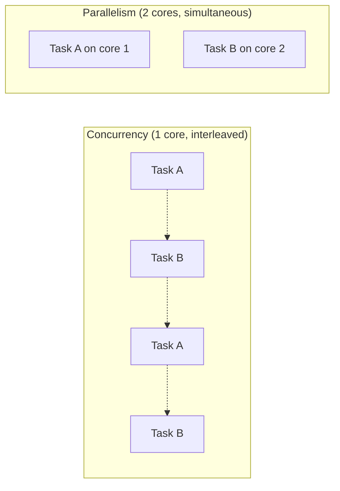
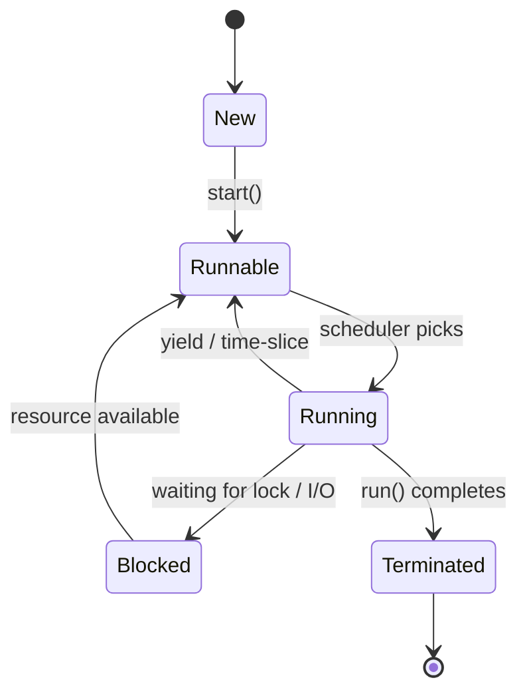

# 08 — Concurrency & Multithreading

> Concurrency shows up in LLD when multiple actors touch shared state — booking
> the same seat, withdrawing from the same account, a thread pool serving
> requests. You must reason about **correctness under interleaving** and use the
> right **synchronization primitive**.

Three parts:
1. **Concurrency 101** — the mental model.
2. **Synchronization primitives** — the tools.
3. **Challenges & classic patterns** — the pitfalls and reusable solutions.

> ⚠️ **Python note (GIL):** CPython's Global Interpreter Lock means threads don't
> run Python bytecode truly in parallel — great for I/O-bound work, not CPU-bound
> (use `multiprocessing` for CPU parallelism). The *concepts* below (locks, race
> conditions, deadlock) still fully apply, and the `threading` API mirrors other
> languages, so it's ideal for learning.

---

## Part 1 — Concurrency 101

### Concurrency vs Parallelism
- **Concurrency**: dealing with many tasks at once by **interleaving** them
  (structure). One core rapidly switching between tasks is concurrent.
- **Parallelism**: actually **executing** many tasks at the same instant
  (execution) — needs multiple cores.

> Concurrency is about *dealing with* many things; parallelism is about *doing*
> many things simultaneously. You can have concurrency without parallelism.



### Processes vs Threads

| | Process | Thread |
|---|---------|--------|
| Memory | Own isolated address space | **Shared** memory with sibling threads |
| Cost | Heavy to create/switch | Light |
| Communication | IPC (pipes, sockets) | Shared variables (needs synchronization) |
| Failure | Isolated (one crash ≠ others) | One bad thread can corrupt shared state |

Threads sharing memory is exactly *why* we need synchronization.

### Thread lifecycle & states



- **New** → created, not started.
- **Runnable** → ready, waiting for CPU.
- **Running** → executing.
- **Blocked/Waiting** → waiting on a lock, I/O, or condition.
- **Terminated** → finished.

### Race conditions & critical sections

A **race condition**: the result depends on the *timing/interleaving* of threads.
A **critical section**: code touching shared state that must not run concurrently.

```python
import threading

counter = 0

def increment():
    global counter
    for _ in range(100_000):
        counter += 1          # NOT atomic: read, add, write — can interleave

threads = [threading.Thread(target=increment) for _ in range(2)]
for t in threads: t.start()
for t in threads: t.join()
print(counter)   # often < 200000 — lost updates due to a race
```

`counter += 1` is three steps; two threads can read the same value and both write
back the same +1, losing an update. The fix is to make the critical section
mutually exclusive (next section).

---

## Part 2 — Synchronization Primitives

### Mutex / Lock — mutual exclusion
Only one thread holds the lock at a time → serializes the critical section.

```python
import threading

counter = 0
lock = threading.Lock()

def increment():
    global counter
    for _ in range(100_000):
        with lock:            # acquire on enter, release on exit (even on error)
            counter += 1      # now atomic w.r.t. other threads
```

Always release the lock (use `with`) to avoid leaving it held forever. Keep
critical sections **short** to reduce contention.

### Semaphore — limit concurrent access to N
A counter-based lock allowing up to **N** threads in at once (mutex = semaphore
with N=1). Great for resource pools / rate limiting.

```python
import threading

# Allow at most 3 concurrent downloads:
sema = threading.Semaphore(3)

def download(url):
    with sema:                # blocks if 3 are already running
        print(f"Downloading {url}")
```

### Condition Variable — wait for a condition / signal
Lets threads **wait** until notified that some state changed. Combines a lock with
wait/notify — the backbone of producer-consumer.

```python
import threading
from collections import deque

buffer, MAX = deque(), 5
cond = threading.Condition()

def producer(item):
    with cond:
        while len(buffer) >= MAX:
            cond.wait()          # release lock & sleep until notified
        buffer.append(item)
        cond.notify()            # wake a waiting consumer

def consumer():
    with cond:
        while not buffer:
            cond.wait()
        item = buffer.popleft()
        cond.notify()            # wake a waiting producer
        return item
```

> Always call `wait()` inside a `while condition:` loop (not `if`) to guard
> against **spurious wakeups** and stale conditions.

### Coarse vs Fine-grained locking
- **Coarse-grained**: one big lock over a large region/whole structure. Simple,
  but low concurrency (threads queue up).
- **Fine-grained**: many small locks over independent pieces (e.g., per-bucket
  locks in a hash map). More concurrency, but more complex and higher deadlock
  risk.

Trade-off: **simplicity/safety** vs **throughput**. Start coarse; go fine only
where contention is proven.

### Reentrant Lock (RLock)
A lock the **same thread** can acquire multiple times without deadlocking itself
(useful for recursive calls or a locked method calling another locked method).

```python
import threading

rlock = threading.RLock()

def outer():
    with rlock:
        inner()          # same thread re-acquires — OK with RLock, deadlock with Lock

def inner():
    with rlock:
        ...
```

### Try-Lock & Timed Locking
Acquire *without blocking forever* — try once, or wait up to a timeout. Lets you
back off instead of hanging, a key deadlock-avoidance tool.

```python
import threading
lock = threading.Lock()

if lock.acquire(blocking=False):     # try-lock: don't wait
    try: ...
    finally: lock.release()
else:
    ...   # couldn't get it — do something else

if lock.acquire(timeout=2.0):        # timed: wait at most 2s
    try: ...
    finally: lock.release()
```

### Compare-and-Swap (CAS) — lock-free atomics
An atomic hardware operation: "if this value is still X, set it to Y, else fail."
Basis of **lock-free** data structures and optimistic concurrency (retry loops).
Avoids lock overhead but can suffer the **ABA problem**.

```text
CAS(address, expected, new):
    atomically:
        if *address == expected:
            *address = new;  return True
        return False
# Typical use: read value, compute new, CAS; if it fails, someone else changed it — retry.
```

Python doesn't expose raw CAS (GIL makes many ops atomic), but you'll discuss it
for Java/C++ (`AtomicInteger.compareAndSet`, `std::atomic`).

### Primitives cheat sheet

| Primitive | Use it for |
|-----------|-----------|
| Mutex/Lock | One-at-a-time access to a critical section |
| Semaphore(N) | Cap concurrent access to N (pools, rate limits) |
| Condition | Wait for / signal a state change (producer-consumer) |
| RLock | Re-entrant/recursive locking by the same thread |
| Try/Timed lock | Avoid blocking forever; deadlock avoidance |
| CAS | Lock-free atomic updates, optimistic retries |

---

## Part 3 — Challenges & Classic Patterns

### Deadlock
Two+ threads each hold a lock the other needs → all stuck forever. Needs **all
four Coffman conditions**: mutual exclusion, hold-and-wait, no preemption,
circular wait.

```python
# Classic deadlock: threads acquire A,B in opposite orders
# T1: lock_a -> lock_b        T2: lock_b -> lock_a   => circular wait
```

**Prevention (break any one condition):**
- **Lock ordering** — always acquire locks in a global fixed order (breaks
  circular wait). Most practical fix.
- **Timed/try-locks** — back off and retry if you can't get all locks.
- Acquire all needed locks at once, or avoid hold-and-wait.

### Livelock
Threads aren't blocked but keep **reacting to each other** and make no progress
(two people stepping aside in a corridor, repeatedly). Fix with randomized
backoff.

### Starvation
A thread never gets the resource because others keep winning (e.g., low-priority
thread starved by high-priority ones). Fix with fair scheduling / fair locks.

### Signaling Pattern
One thread tells another that an event/condition occurred — built on condition
variables or events. Foundation for coordinating "wait until ready".

```python
import threading
ready = threading.Event()

def worker():
    ready.wait()          # block until signaled
    print("Go!")

threading.Thread(target=worker).start()
ready.set()               # signal: wake all waiters
```

### Thread Pool Pattern ⭐
Reuse a fixed set of worker threads to process tasks from a queue — avoids the
cost of creating a thread per task and bounds concurrency.

```python
from concurrent.futures import ThreadPoolExecutor

def handle(task): return task * 2

with ThreadPoolExecutor(max_workers=4) as pool:
    results = list(pool.map(handle, range(10)))   # 4 threads reused across 10 tasks
```

Used everywhere: web servers, job processors. Key knobs: pool size, queue
bounds, rejection policy.

### Producer-Consumer Pattern ⭐
Producers put work on a shared **bounded queue**; consumers take it off. Decouples
rates and smooths bursts. Python's `queue.Queue` is thread-safe and handles the
locking/blocking for you.

```python
import threading, queue

q: queue.Queue = queue.Queue(maxsize=5)   # bounded buffer

def producer():
    for i in range(10):
        q.put(i)            # blocks if full

def consumer():
    while True:
        item = q.get()      # blocks if empty
        print("consumed", item)
        q.task_done()

threading.Thread(target=producer).start()
threading.Thread(target=consumer, daemon=True).start()
```

### Reader-Writer Pattern
Many **readers** can access shared data simultaneously, but a **writer** needs
exclusive access. Optimizes read-heavy workloads. Beware **writer starvation**
(constant readers block writers) — use a fair readers-writer lock.

```text
Rules:
- Multiple readers allowed concurrently (shared lock).
- A writer excludes all readers and other writers (exclusive lock).
```

---

## Applying concurrency in LLD problems

Typical interview moments where you must mention synchronization:

| Scenario | Concern | Tool |
|----------|---------|------|
| Two users book the same seat/ticket | Race on seat state | Lock per seat / DB row lock |
| Concurrent withdrawals from an account | Lost update / overdraft | Lock around balance update |
| Rate-limit N concurrent API calls | Bounded concurrency | Semaphore(N) |
| Worker processing background jobs | Efficient task handling | Thread pool + producer-consumer queue |
| Inventory decrement under load | Atomic update | CAS / atomic / row lock |

**Rules of thumb:**
- Identify the **shared mutable state** and the **critical sections** first.
- Keep critical sections **short**; prefer immutable data where possible.
- Prefer higher-level constructs (`Queue`, `ThreadPoolExecutor`) over hand-rolled
  locks when you can.
- Use **consistent lock ordering** to prevent deadlock.

---

## Quick self-check

1. Concurrency vs parallelism — one sentence each.
2. Why do threads (not processes) require synchronization for shared data?
3. Why must `condition.wait()` sit inside a `while`, not an `if`?
4. Name the four Coffman conditions; which does lock ordering break?
5. Semaphore vs mutex — what's the relationship?
6. When would you pick a thread pool + queue over spawning a thread per task?
7. What's the risk in the reader-writer pattern and how do you address it?

---

## Where this maps in the repo
- Apply these when solving concurrent problems in
  `concepts_and_problems/Problem Statements/` (e.g., movie/concert booking,
  parking lot, digital wallet, LRU cache with thread safety).
- This completes the **LLD Basics** series. Next: start solving problems in
  `concepts_and_problems/Problem Statements/`, applying principles → patterns →
  UML → concurrency.
```